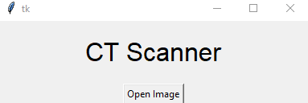
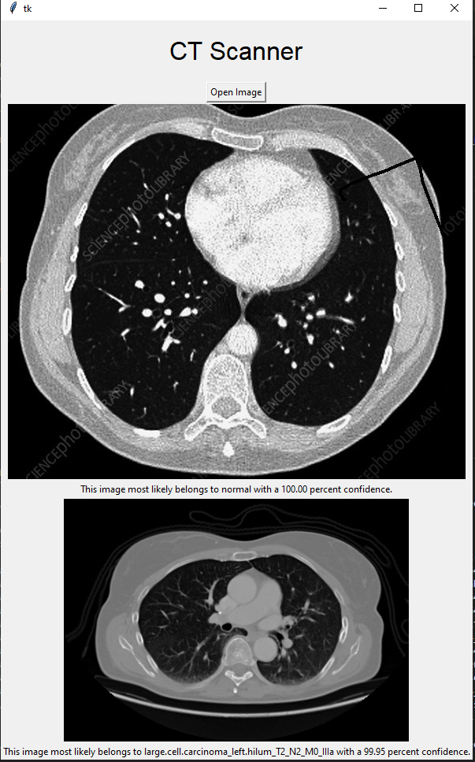
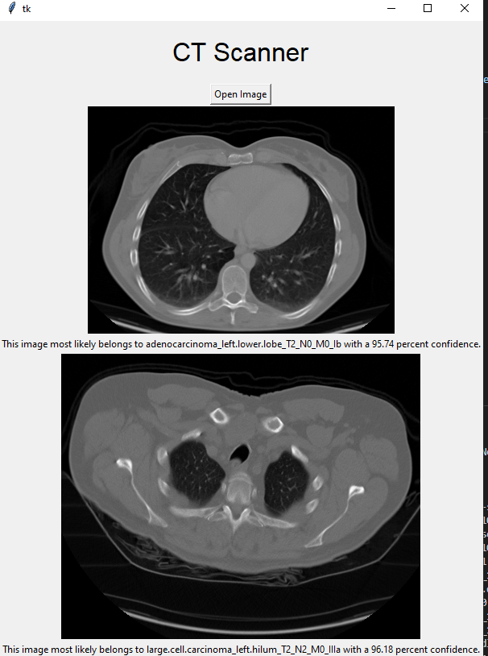

# Chest CT Scanner
## A python app that scans CT images of torsos.

### This machine learning program takes a input of a image and uses deep learning to classify the image.

#### Screenshots:

# Credits:

### Created with tkinter and tensorflow

## Johann Pineda:

[theonejohann - Github](https://github.com/theonejohann)

[Johann Pineda | LinkedIn](https://www.linkedin.com/in/johann-pineda-97992a235/)

[Johann - Medium](https://medium.com/@theoneonlyjohann)

[johann (@theoneandonlyjohann) * Instagram photos and videos](https://www.instagram.com/theoneandonlyjohann/)